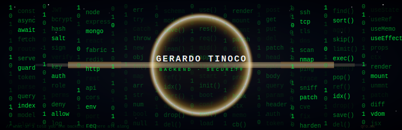

# Hey, I'm Gerardo Tinoco 👋
### Backend Developer · Building things that work, securing things that matter

I'm a software engineer based in **Querétaro, México**, focused on backend development with Node.js and always curious about how systems can be broken — and hardened.

I come from an IT operations background and have been transitioning full-time into software engineering, building real products along the way.

---

## 🛠 Tech Stack

**Backend**
`Node.js` `Express.js` `REST APIs` `JWT` `bcrypt`

**Frontend**
`React` `Fabric.js`

**Databases**
`MongoDB` `Oracle`

**Tools & Platforms**
`Git` `Linux` `ServiceNow`

---

## 🚀 What I'm building

**QR Payment Platform** *(in progress)*
A digital menu system integrated with MercadoPago, allowing businesses to receive payments via QR code directly from a customer-facing menu. Built with Node.js and Express.

**Presentation Editor**
Full-stack canvas-based editor built from scratch with React and Fabric.js. Features JWT authentication, role-based access control, and a complete REST API backed by MongoDB.

**CRM Backend**
Contributed backend features to an existing CRM: bcrypt password hashing, a rule-based chatbot assistant, and extended REST API endpoints.

---

## 🔐 Security interests

Cybersecurity is a hobby that shapes how I write code. I think about authentication flows, input validation, and access control not as checkboxes but as design decisions. Currently exploring ethical hacking fundamentals on the side.

---

## 📫 Let's connect

---

*English (B2 · IELTS 2025) · Spanish (Native) · Mandarin Chinese (HSK-1)*
<!--
**GerardoCoronel98/GerardoCoronel98** is a ✨ _special_ ✨ repository because its `README.md` (this file) appears on your GitHub profile.

Here are some ideas to get you started:

- 🔭 I’m currently working on ...
- 🌱 I’m currently learning ...
- 👯 I’m looking to collaborate on ...
- 🤔 I’m looking for help with ...
- 💬 Ask me about ...
- 📫 How to reach me: ...
- 😄 Pronouns: ...
- ⚡ Fun fact: ...
-->
